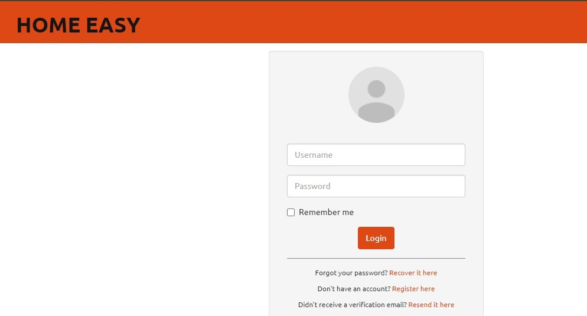
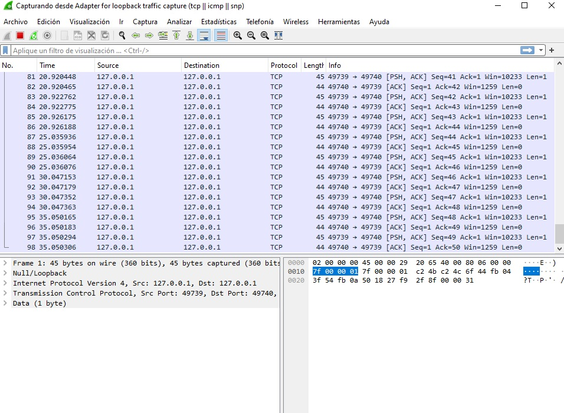
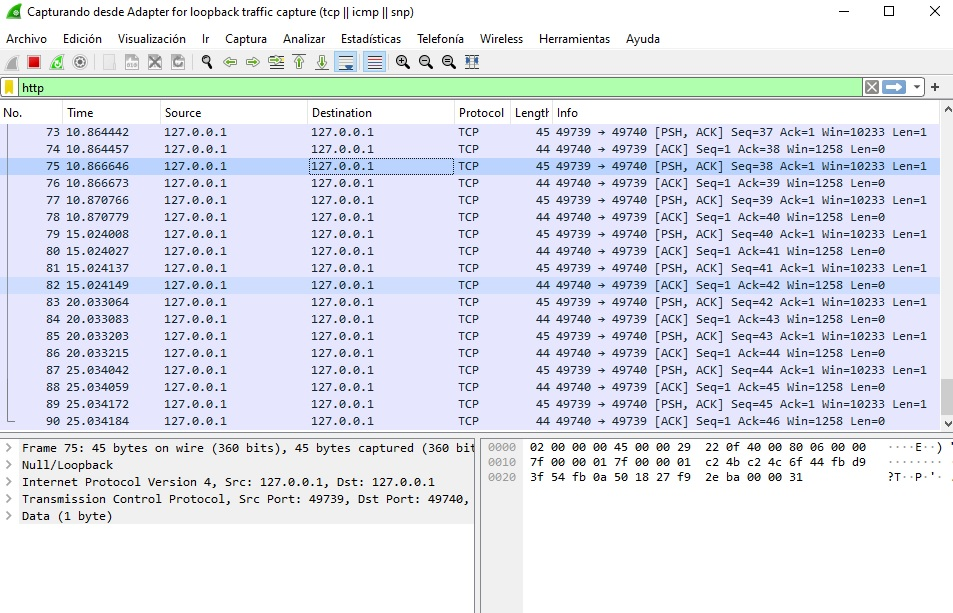

# 
INFORME DE ANALISIS HOME EASY

Nombre: Carlos Muñoz

Cargo: administrador sitio web

Fecha: 12-8-2024

## 
Resumen ejecutivo
Este informe tratara sobre un análisis realizado a nuestra web HOME EASY, el cual es un análisis preventivo para validar que nuestra web no fue afectada, se realizara una variada cantidad de escaneos y con el resultado de estos se darán recomendaciones para mitigarlos

## 
Introducción
Home Easy, es una empresa relativamente nueva en el área, dedicada al presupuesto y posterior venta de diferentes tipos de hormigón por metro cubico. El objetivo de este análisis es revertir prontamente el daño si es que fue causado y si no realizar un escaneo preventivo

## 
Antecedentes del caso
Home Easy es una plataforma que presta servicios a clientes y gestiona presupuestos para proyectos. El fondo de conjunto de cooperación Chile-México ha sufrido un ataque durante la implementación de una de sus infraestructuras críticas y por lo tanto es necesario un análisis profundo y recolectar la información de daño a nivel de ciberseguridad

## 
Objetivos del análisis
Realizar un análisis forense exhaustivo para identificar las vulnerabilidades explotadas, recolectar evidencia y determinar la extensión del compromiso

## 
Metodología
Herramientas
Wireshark, Nmap, Owasp Zap

## 
Procedimientos
- Utilizar Wireshark para capturar y analizar paquetes de red, detectar intrusos y ataques, actividad sospechosa.

- Nmap para descubrir que hots están activos en una red, escaneos de puertos para identificar que puertos están abiertos y que servicios están corriendo en cada puerto

- Owasp Zap analizar el tráfico entre el cliente y el servidor, detectar vulnerabilidades para que no sean explotadas 

## 
Hallazgos
- Evidencia digital: no se encontraron anomalías en el log del sistema 

- Análisis de red: el análisis de red demostró estar dentro de un rango de normalidad sin alteraciones significativas 

- Análisis de sistema: se realizó un escaneo de la aplicación web y mostro algunas vulnerabilidades que podrían ser explotadas

 Se aplicó análisis con Wireshark a protocolo "HTTP" puerto 80 y no mostro resultados anómalos

 

 
 

 

 
 

 Se realizó escaneo a la ip 127.0.0.1 con nmap y no mostro anomalías visibles 

 
 

 
 

Se realizo un escaneo de Zap para verificar vulnerabilidades y si fueron explotadas

 
 

## 
Conclusión

Tras una investigación y una variedad de testeos a la página web HOME EASY, se detectó una vulnerabilidad en una falta de actualización del  sistema de validación, el ataque realizado al fondo conjunto de cooperación Chile-México por suerte no se extendió hasta nuestra web Home Easy, pero hay que tomar en cuenta que si existían vulnerabilidades en nuestra web Home Easy

## 
Recomendaciones
- Aplicar frecuentemente actualizaciones y parches de seguridad

- Ver la opción de obtener un firewall tipo hardware

- Realizar escaneos de red de manera más frecuente

- Mantener una red extra en caso de un nuevo tipo de ataque de este tipo no detener los servicios

- Seguir validando falencias en nuestra web Home Easy 

