

# Manual técnico

En este manual técnico del proyecto de aplicación web HOME EASY, se explicará las funciones tanto de administrador como de usuario, esta aplicación trata sobre una empresa que realiza cotizaciones online para venta de hormigón por metro cubico y cuenta con tres valores de precio de manera inicial ya que hay 3 tipos de mezclas sería el tipo 1, tipo 2 y tipo 3 con diferentes valores
A continuación, se mostrará la estructura de las tablas 

### Tabla registro de usuario

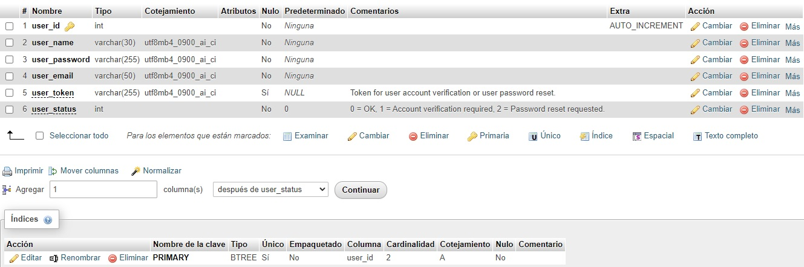

### Tabla cotizaciones

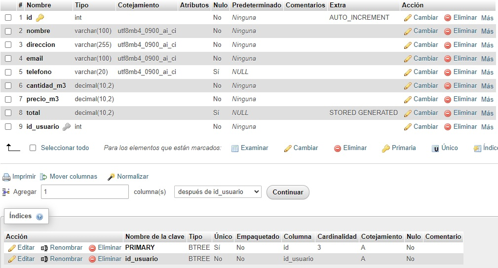

### Tabla contacto

##Tabla stock

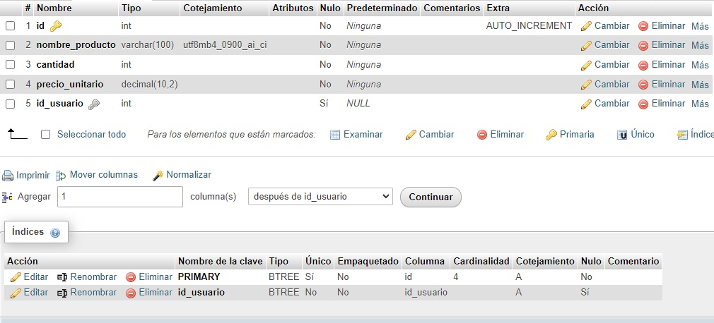

### Tabla total stock (nota: en esta tabla no se ingresarán datos de forma manual solo mostrara el total de stock)

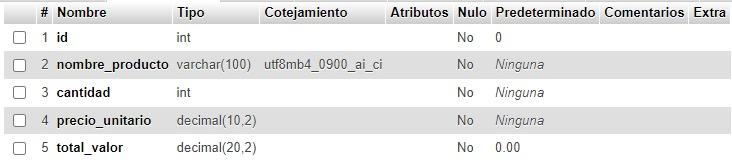

A continuacion se dara a conocer el funcionamiento del sistema web home easy, se mostrara la pantalla de registro en la cual solo se debe poner el nombre de usuario que debe ser unico para cada persona al igual que el correo electronico 

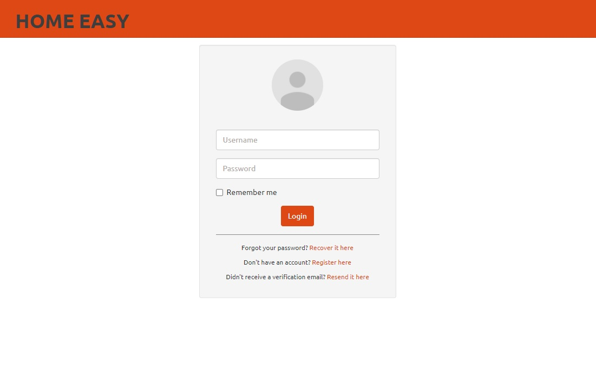

Se ha creado una cuenta de ejemplo con el nombre de usuario “carlos” y contraseña “12345” a modo de ejemplo para que sea administrador, el cual tendra todos los privilegios en la plataforma web

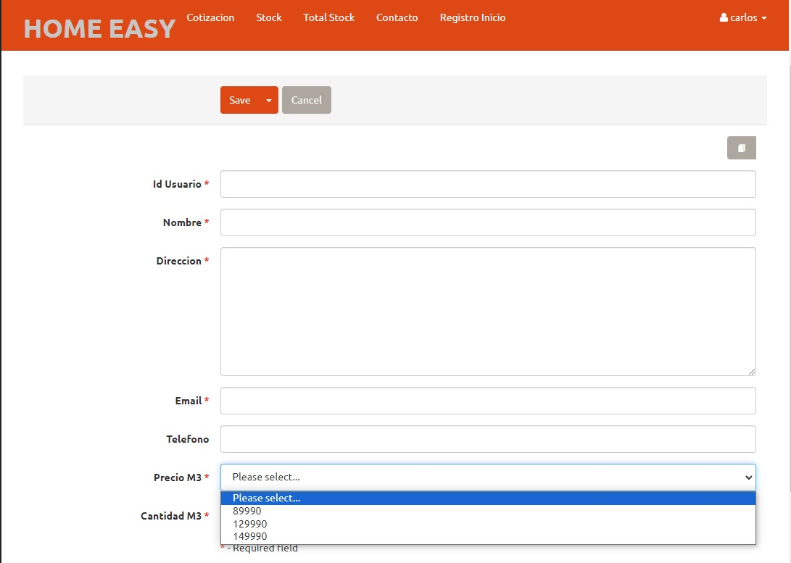

Y otras cuentas de usuarios que solo tendrán acceso a 2 páginas de “cotización” y “contacto” como por ejemplo nombre de usuario “Vladimir” y contraseña “12345”

Las contraseñas se almacenan en la base de datos encriptadas en SHA256 para tener una mayor seguridad de los datos del cliente y o usuario y un token para verificar a este mismo

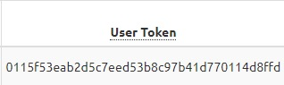

Se realizaron validaciones de campos de formularios como del teléfono que sea numérico, el email sea coherente en cuanto a formato y el ingreso de cantidades numéricas también

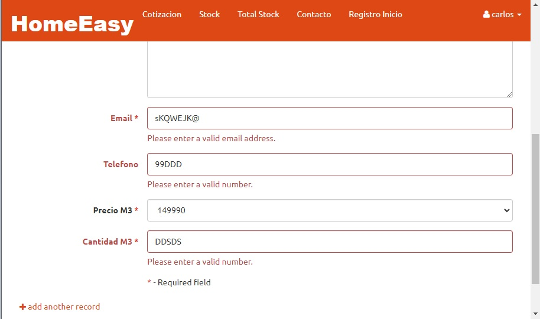

## A continuación, se verá cada pantalla con sus respectivos formularios y campos

### Pantalla contacto

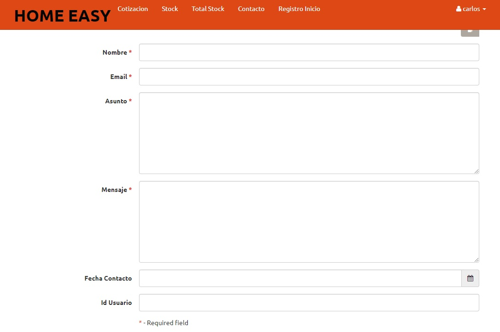

### Pantalla cotización

### Pantalla stock

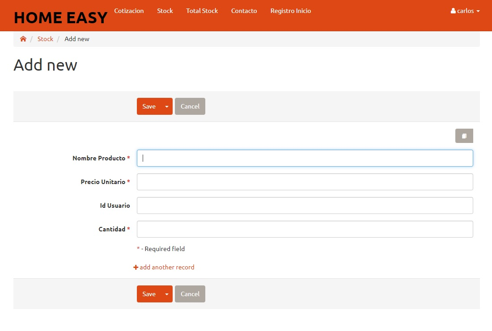

### Pantalla total stock

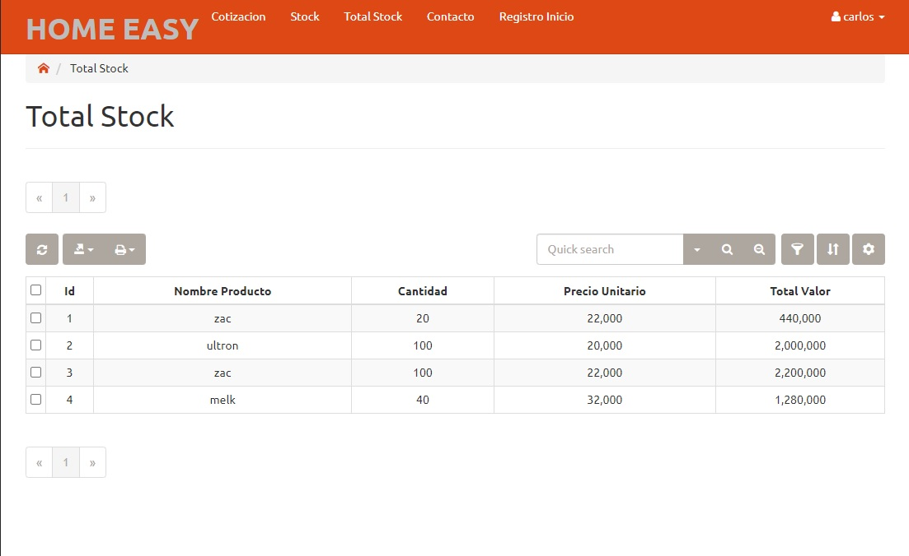

### En esta pantalla se mostrará las funciones de los botones de los formularios

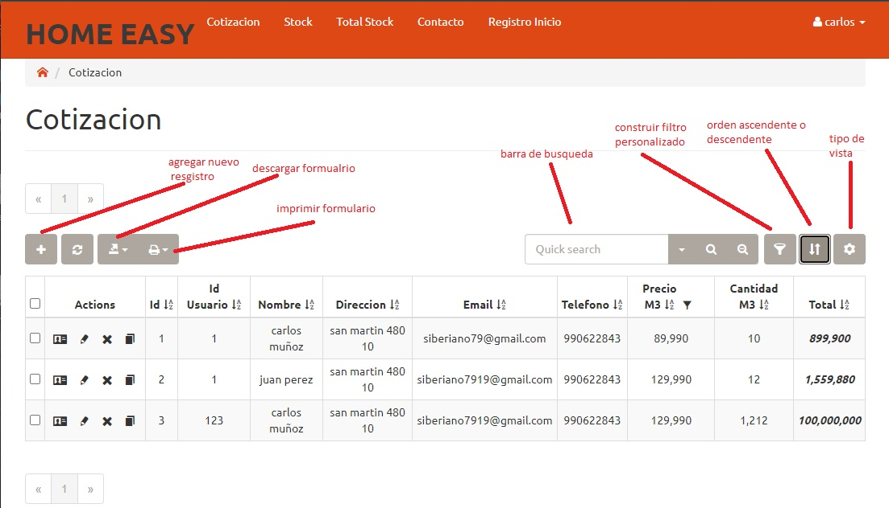

Algunas cosas que no se lograron arreglar por el momento fue que llegara un correo de verificación para autentificar la cuenta creada, una solución momentánea fue ingresar al registro de la tabla donde se almacenan los datos de creación de usuario y modificar el valor a “0” para que se pudiera verificar la cuenta

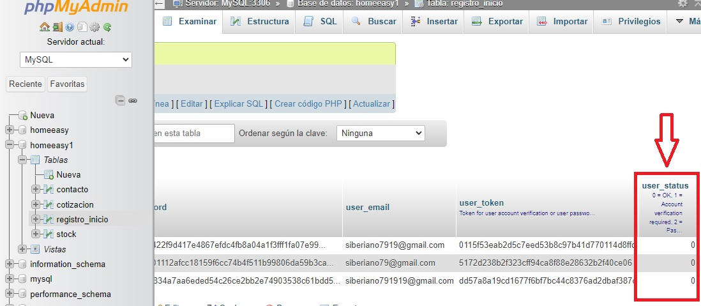

