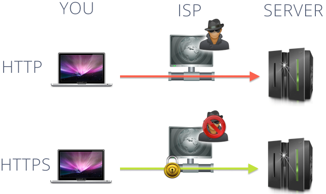
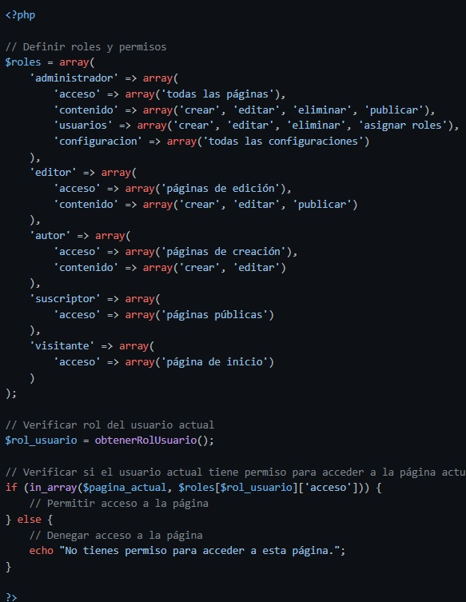
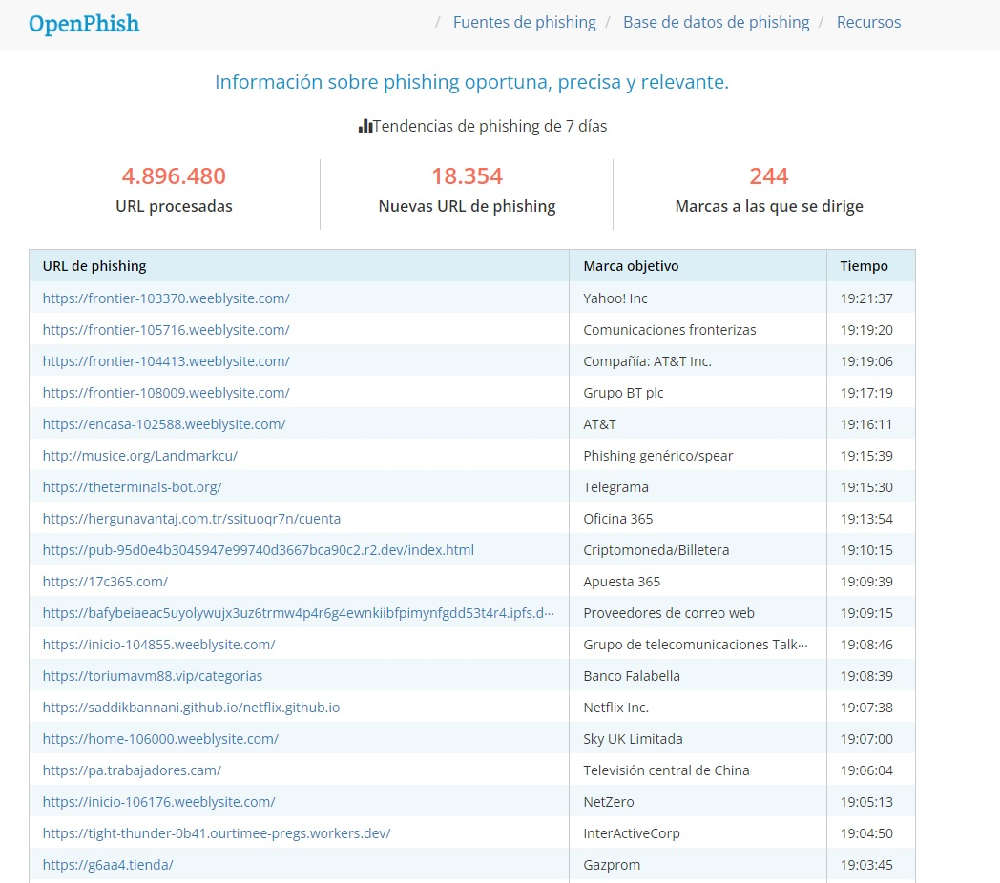
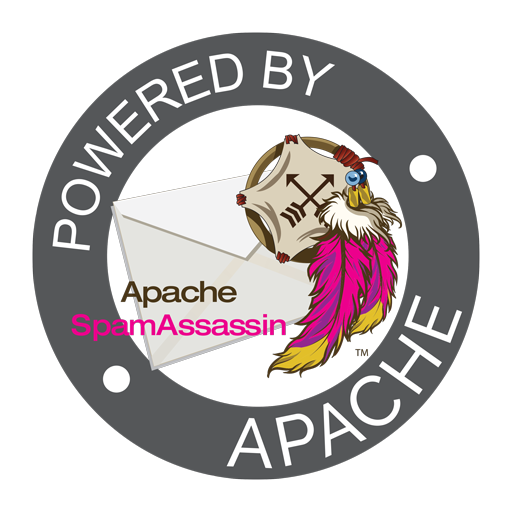
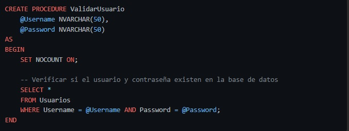
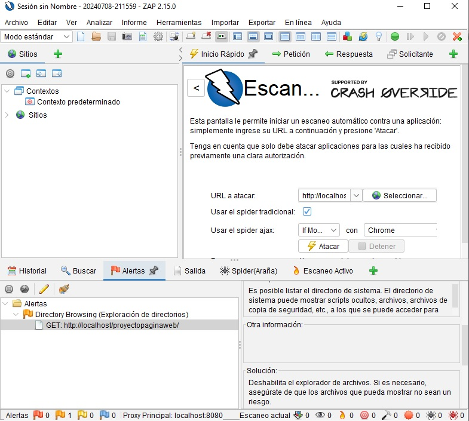
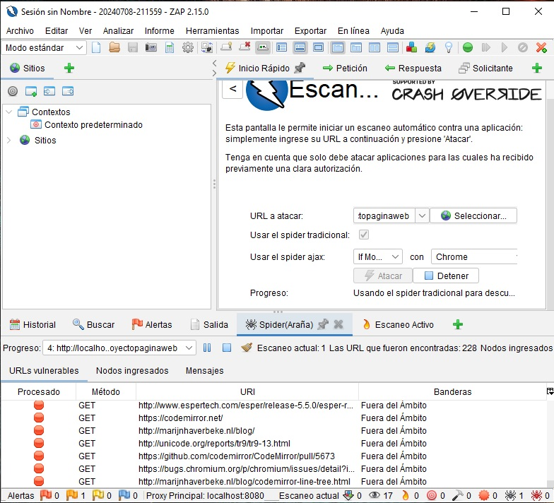
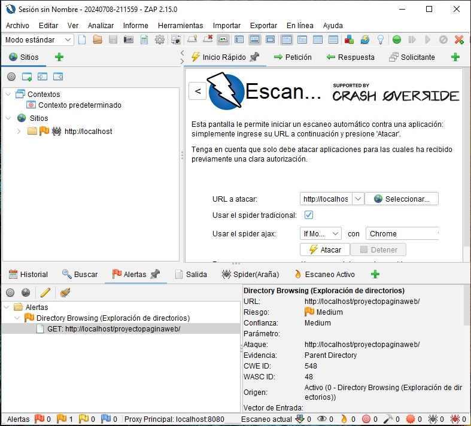
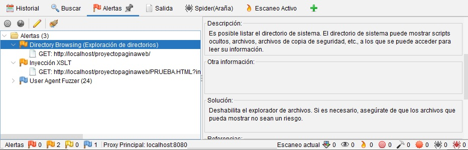
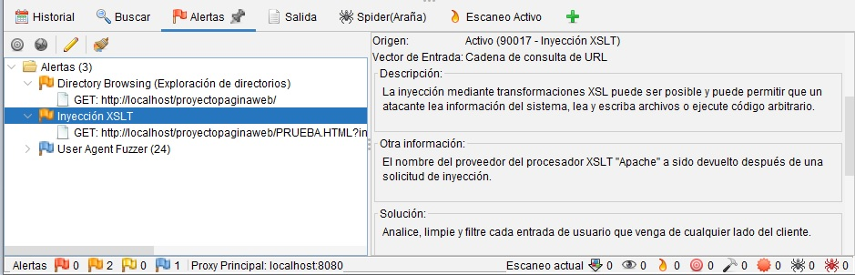

# 
**Informe de implementador**

	

Nombre: Carlos Muñoz

Rol: Implementador

Curso: Redes seguras y Ciberseguridad

Nombre proyecto: Home Easy

Fecha de entrega: 24-7-2024

---

## 
**Índice**

•	Índice							

•	Introducción						

•	Configuración de sistema de control de acceso y cifrado de datos  				

•	Implementar validaciones de entrada  para evitar errores y ataques		

•	Conclusión								

•	Bibliografía							

---

## 
**Introducción**

En este informe de implementador se dará a conocer varios temas entre estos son:

-Configurar sistemas de control de acceso y cifrado de datos

-Implementar validaciones de entrada para evitar errores y ataques 
se darán varios ejemplos de cada punto para evaluar la mejor opción y dar
un equilibrio entre seguridad y una implementación que no sea complicada de desarrollar,
además se implementará la herramienta de escaneo de penetración y vulnerabilidades ZAP 

---

## 
**Configuración de sistema de control de acceso y cifrado de datos**

La seguridad es un aspecto importante para la creación de una página web, uno de los 
puntos principales y en el inicio es plantear el uso de HTTPS para poder cifrar la
 comunicación entre el servidor y el usuario. Para poder proteger los datos personales,
  como información privada y contraseñas, de ser interceptados.

Autenticación y control de acceso, para esto se implementará un sistema de contraseñas
 robustas que requieran letras mayúsculas minúsculas, números, símbolos como por ejemplo
  (¡#$%&/()=?¡) que puede ser implementado a través de un generador de contraseñas, también
   limitar el intento de inicio de sesión a una cierta cantidad de veces y dar un tiempo de
    espera para volver a intentar, esto disminuye el ataque de fuerza bruta y o de denegación de servicio(DOS)

Un control de acceso, definir que usuarios necesitan acceder a la información según el nivel, crear roles y permisos de usuario como:

-administrador que tiene permiso total de las funcionalidades del sitio web, como configurar el sitio, gestionar usuarios

-moderador puede gestionar contenido generado por usuarios y velar que cumplan con las normas de la página web

-usuario personas registradas en la página que van a tener acceso a cierta parte de la web como cotizar comprar y comunicarse para presupuestos

-invitado solo podrá navegar por las páginas básicas, tendrán acceso limitado como solo visualizar contenido

Esto se puede implementar a través de herramientas como PHP

ejemplo:

Tener una lista negra de sitios web y correos electrónicos constantemente, si bien hay un cierto 
desfase entre cuando se descubre una amenaza y cuando se agrega a la lista negra, esto puede ofrecer
 información constantemente y estar al tanto

Ejemplo:
https://openphish.com/index.html

Mantener el software actualizado ya que si no se actualiza puede provocar vulnerabilidades
 que pueden ser ultilizadas para ataques de hack y enviar correo no deseado o con malware. 
 Hay que asegurarse de mantener el sistema operativo, software de correo electronico y otros
  software al dia con las actualizaciones y parches

Utilizar un filtro de correos electronicos de buena reputacion puede ayudar a bloquear el correo
 no deseado y el malware antes de que llegue a la bandeja de entrada como SpamAssasin seria una buena 
 opcion ya que es de codigo abierto y ampliamente usado, es altamente personalizable y efectivo. 
 Es mas ultilizado en ambiente Linux / Unix pero tambien compatible con Windows
https://spamassassin.apache.org/

---

## 
**Implementar validaciones de entrada para evitar errores y ataques**

Validaciones del lado del servidor como, por ejemplo:
-validación de formato: verificar que los datos ingresados cumplan con el formato establecido 
como por ejemplo que el correo electrónico sea válido contenga un “@” y los puntos correspondientes
 y las fechas tengan un formato establecido como 24/11/2024 y no un 24-nov.-2024

-validar la entrada de datos: esto puede ayudar a prevenir errores y ataques como, datos no validos 
que puedan ingresar texto en un campo de número telefónico, esto puede dejar una brecha para ataques maliciosos, 
como una inyección de código lo que podría terminar en que tomen el control de la aplicación web

-utilizar consultas SQL parametrizadas: son esenciales para la seguridad, especialmente
 en la prevención de ataques de inyección SQL, estos aprovechan la falta de validación en las entradas de usuario,
  al no utilizar estas prácticas puede permitir robo de datos sensibles como contraseñas, datos de tarjeta de crédito 
  o datos personales, también los atacantes pueden modificar o eliminar datos importantes en la base de datos y en algunos 
  casos tomar el control del servidor lo que les daría a todos los datos y sistemas

Este es un ejemplo de una consulta parametrizada

Y por último realice la instalación de ZAP que es una herramienta que realiza pruebas de penetración,
auditorias de seguridad, tiene un escaneo automático y manual, análisis detallado del trafico y generador de informes, 
realice pruebas a el proyecto que estamos realizando

 

En las imágenes a continuación se muestran vulnerabilidades después de realizar el escaneo y la posible solución

---

## 
**Conclusión**

Implementar medidas de seguridad robustas es importante desde el principio del proyecto ya que si esto no se realiza 
pueden influir en una mayor demanda de consumo de recursos tanto monetarios, de tiempo del proyecto y horas hombre.
Estas medidas no solo protegen nuestro proyecto, sino que también los datos de usuario/cliente y fortalece la confianza del proyecto web
 y nuestra plataforma para con nuestros servicios ofrecidos, estos son temas de actualidad ya que los ataques maliciosos
  hoy en día son cada vez más frecuentes y dañinos. 

La seguridad informática(ciberseguridad) es un proceso continuo siempre van apareciendo nuevas formas de ataque y nuevas formas
 de prevenir o escudarse de estos, con esto quiero decir que al implementar estas medidas en este informe no es algo que será lo 
 suficientemente seguro en el tiempo, siempre hay que estar al tanto y actualizado para poder implementar nuevas formas de seguridad en 
 nuestra plataforma y futuros proyectos mientras esto lo requiera 

---

## 
**Bibliografía**

https://introbay.com/blog/https-que-es-y-para-que-sirve

https://groups.google.com/g/symfony-es/c/BH_lf6Afbec?pli=1

https://es.wikipedia.org/

https://www.zaproxy.org/
