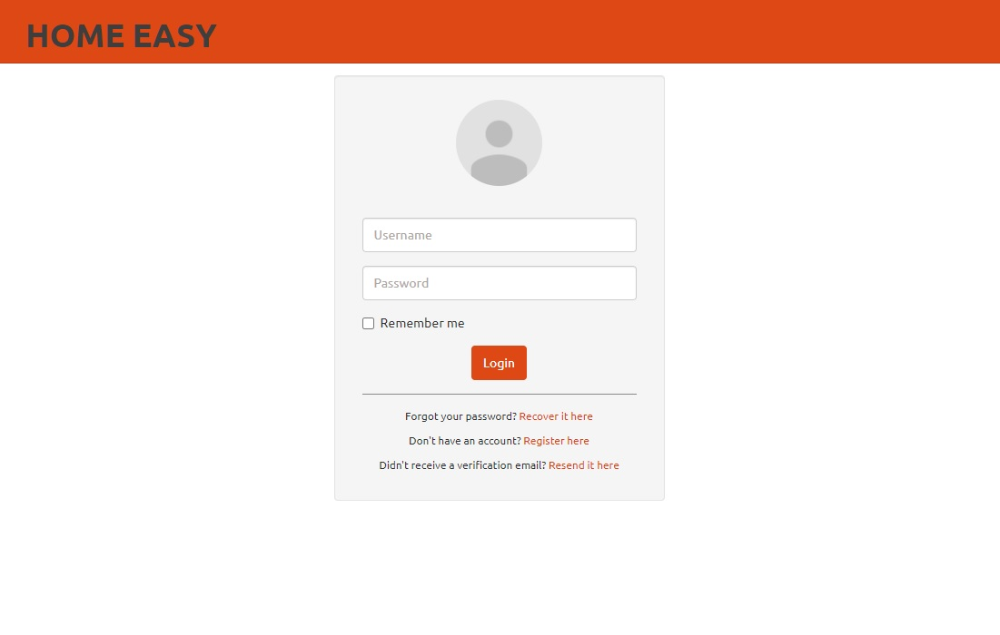
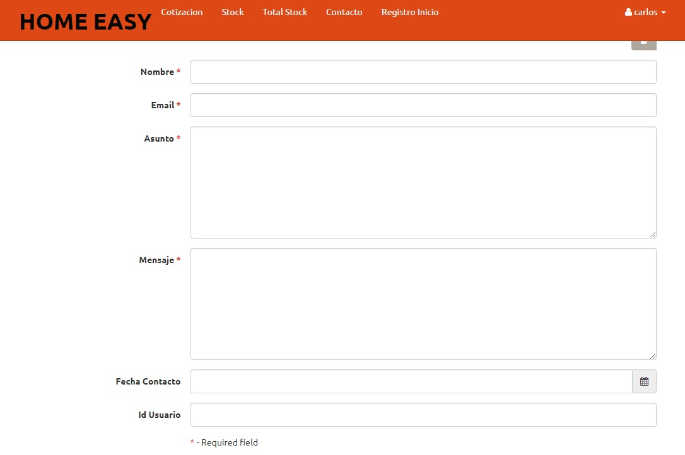
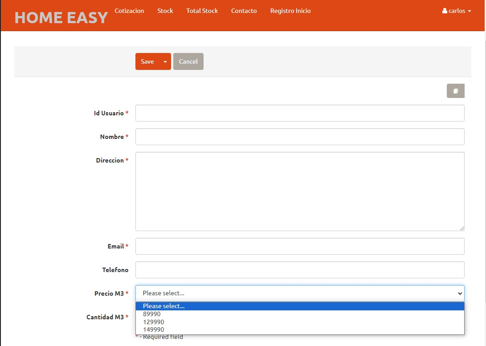

# MANUAL DE USUARIO EN PLATAFORMA WEB “HOME EASY”

**Matias Espinoza Veliz:** Analista – Evaluador  
**Carlos Muñoz Herrera:** Implementador-Evaluador  
**Christopher Espinoza Ordenes:** Docente  
**Fecha:** 14-08-2024

## Propósito del manual
El manual tiene como objetivo proporcionar una guía detallada sobre el uso de la plataforma web “Home Easy”. Se enfoca en facilitar el proceso de navegación y optimizar la experiencia del usuario, permitiendo gestionar de manera eficiente sus necesidades ofrecidas por la plataforma.

## Descripción de la plataforma
“Home Easy” es una plataforma web diseñada para ayudar a los usuarios en la gestión de proyectos de construcción, especialmente en la planificación y cotización de hormigón. La plataforma permite generar cotizaciones y mantener un registro organizado de todos los contactos y operaciones comerciales.

Está orientada a mejorar la eficiencia en la creación de presupuestos y facilitar la toma de decisiones en proyectos de construcción.

## Requisitos del Sistema
- **Navegador web compatible:** Google Chrome, Mozilla Firefox, Microsoft Edge.
- **Conexión a internet estable:** Se recomienda una conexión a internet de banda ancha para una experiencia fluida.
- **Servidor local con WAMP server instalado:** Necesario para la ejecución y gestión de la base de datos en un entorno de desarrollo local.

## Home Easy

### Inicio de Sesión
- Instrucciones para ingresar a la plataforma mediante un navegador web utilizando el URL proporcionado.
- **Campos requeridos:** Nombre de usuario y contraseña.
- Recuperación de contraseña.
- Cierre de sesión.

### Gestión de Contactos

- Añadir un Nuevo contacto
- Descripción del formulario de contacto: campos como nombre, email, asunto, mensaje, etc.
- Instrucciones paso a paso para completar el formulario y guardar un Nuevo contacto.

### Gestión de Cotizaciones

- Descripción del proceso de creación de cotizaciones, incluyendo la selección de productos/servicios.
- Cálculo automático de totales basado en la cantidad y precio por metro cúbico.
- **Campos adicionales:** nombre, dirección, email, teléfono.

### Control de Stock

- Manejo de inventarios
- Control de cantidades
- Definir precios
- Nombre de producto
- Cantidades de stock

